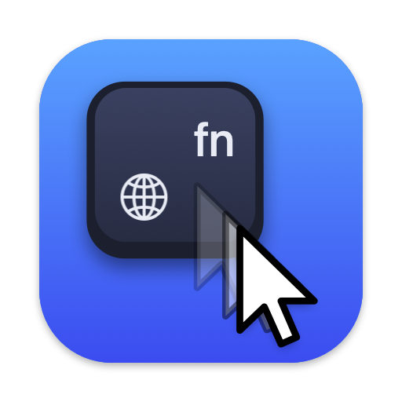

<p align="center"></p>

<h1 align="center">PressureClutch</h1>

<p align="center"><b>Hold fn while dragging. The pointer slows down.</b></p>

Nudging a Figma frame by two pixels. Trimming a clip in Premiere to the exact frame. Setting a slider to 72, not 71 or 74. Cropping a photo on the right line. On a trackpad, the last few pixels of a drag are always the hardest.

PressureClutch adds a clutch to every drag on your Mac: hold **fn** and the pointer follows your finger ten times slower. Let go of fn and it's back to full speed, in the same drag. No mode to switch, nothing to learn, and it works in every app.

## How to use it

1. Start dragging anything: a window, a slider, a layer, a playhead, a selection.
2. Hold **fn** when you get close. The drag keeps going, slower.
3. Release fn to speed up again, or just drop.

From the menu bar icon (the menu is in French for now):

- **Vitesse ralentie** — slowed-down speed: a slider from ÷2 to ÷20.
- **Ralentir en** — trigger: fn, right ⌥, right ⌘, or a firm press on the trackpad (see below).
- **Activé** — turns everything off without quitting.

### Why fn

The other modifiers already mean something during a drag: ⇧ constrains, ⌥ duplicates or copies, ⌘ inserts or toggles snapping — in Finder, Photoshop, Premiere Pro, DaVinci Resolve and most editors. fn is never used as a drag modifier, and it sits under your left hand while the right one is on the trackpad. PressureClutch also hides the trigger key from apps during the drag, so choosing right ⌥ won't turn a move into a copy.

If releasing fn opens the emoji picker or switches input source, set **System Settings › Keyboard › Press 🌐 key to** *Do Nothing*.

### Firm press (experimental)

The name comes from where it started: with the **Firm press** trigger, pressing harder on the trackpad during a drag slows the pointer down (you feel a tick), and pressing again gives it its speed back. The trackpad's force is read per finger from the private `MultitouchSupport` framework, relative to how hard you were already holding the drag. It works, but a key turned out to be more comfortable for long precise work.

## How it works

PressureClutch is a small menu bar app with an event tap at the HID level, on its own thread, so it never slows input down. While the trigger is on, each drag event keeps the finger's real movement, scaled down, added to where the pointer already is; the window server moves the pointer and the dragged object there. When you drop, the pointer is put back in step with the trackpad. Mouse events are never dropped, delayed or added.

- Works with the built-in trackpad, a Magic Trackpad and mice (the firm press trigger needs a Force Touch trackpad).
- Needs **Accessibility** permission, to see and adjust drag events.
- Nothing is stored except the settings. Nothing leaves your Mac.

## Install

Requires macOS 13 or later and the Swift toolchain (Xcode or the Command Line Tools).

```bash
git clone https://github.com/AZerHT/PressureClutch.git
cd PressureClutch
./build.sh --run
```

Grant Accessibility access when asked (System Settings › Privacy & Security › Accessibility).

`build.sh` signs ad hoc by default, so macOS forgets the permission after each rebuild. To keep it, sign with a local certificate: `SIGN_IDENTITY="My Certificate" ./build.sh --run`.

## Limits

- Apps that read the keyboard state directly, instead of from events, may still see the trigger key.
- If a drag reaches the edge of the screen while slowed down, the trackpad's own position can stop before the pointer does.
- The firm press trigger relies on a private framework that a future macOS update could change.

## License

MIT
